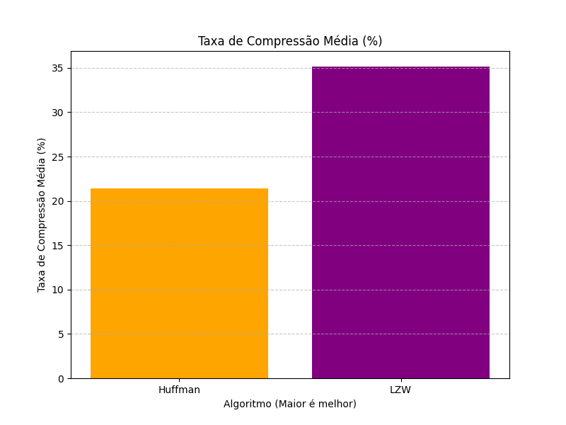

# Ferramenta de Análise Comparativa de Algoritmos de Compressão

Este projeto é uma aplicação de linha de comando desenvolvida em TypeScript para analisar e comparar a eficácia dos algoritmos de compressão **Huffman** e **LZW (Lempel-Ziv-Welch)**. A ferramenta foi criada como parte do trabalho da disciplina de Algoritmos e Estruturas de Dados II.

A aplicação processa imagens no formato `.bmp`, realiza a compressão e descompressão com ambos os algoritmos, e gera um relatório detalhado com métricas de desempenho, incluindo taxa de compressão e tempo de execução.

> A nível de curiosidade, é possível testar os algoritmos individualmente no github pages do projeto, cheque mais detalhes em: (Adicionar link) 

## Pré-requisitos

Antes de começar, certifique-se de que você tem os seguintes softwares instalados em sua máquina:

* [**Node.js**](https://nodejs.org/): Versão **22.x** ou superior.
* [**npm**](https://www.npmjs.com/): Geralmente instalado junto com o Node.js.

## Como Executar

Siga os passos abaixo para configurar e executar o projeto em seu ambiente local.

**1. Clone o Repositório**

```bash
git clone git@github.com:raieenryuu/lzw-huffman-comparacao.git
cd lzw-huffman-comparacao
```

**2. Instale as Dependências**

Execute o comando abaixo no terminal para instalar todas as bibliotecas necessárias para o projeto:

```bash
npm install
```

**3. Adicione as Imagens para Teste**

Para que a ferramenta funcione, você precisa fornecer as imagens que serão analisadas.

* Crie uma pasta chamada `imagens` na raiz do projeto.
* Dentro da pasta `imagens`, você pode:
    * **Organizar por tipo:** Crie subpastas para categorizar suas imagens (ex: `Simples`, `Complexas`, `EscalaDeCinza`). O nome da pasta será usado como o "Tipo da Imagem" no relatório final.
    * **Colocar na raiz:** Adicione arquivos `.bmp` diretamente dentro da pasta `imagens`. Eles serão categorizados com o tipo "Geral".

**Exemplo de Estrutura:**
```
/
├── imagens/
│   ├── Complexas/
│   │   ├── foto_paisagem.bmp
│   │   └── foto_retrato.bmp
│   ├── Simples/
│   │   └── logo.bmp
│   └── imagem_geral.bmp
├── src/
└── package.json
```

**4. Execute a Análise**

Com tudo configurado, execute o seguinte comando no terminal:

```bash
npm start
```

O script irá processar todas as imagens, exibir uma tabela com os resultados no console e salvar os arquivos de saída.

### Resultados Gerados

Após a execução, os seguintes artefatos serão criados na raiz do projeto:

**1. Pasta `resultados/`**

Esta pasta conterá os arquivos gerados durante o processo:

* **Arquivos Comprimidos (`.bin`):** Para cada imagem, serão gerados dois arquivos binários contendo os dados comprimidos.
  * `nome-da-imagem_huffman.bin`
  * `nome-da-imagem_lzw.bin`

* **Imagens Reconstruídas (`.bmp`):** Para verificar que os algoritmos são "lossless" (sem perdas), a ferramenta também salva a versão descomprimida de cada imagem. Estes arquivos devem ser idênticos aos originais.
  * `nome-da-imagem_huffman_reconstruido.bmp`
  * `nome-da-imagem_lzw_reconstruido.bmp`

**2. Relatório em CSV (`resultados_compressao.csv`)**

Um arquivo chamado `resultados_compressao.csv` será criado na raiz do projeto. Ele contém a tabela completa com todas as métricas de desempenho, pronta para ser importada em qualquer software de planilhas (como Excel ou Google Sheets) para a criação de gráficos e análises mais aprofundadas.

## Resultados

Executando a implementação dos algoritmos nas imagens disponíveis em `./imagens` obtivemos:

### Taxa de Compressão

Este gráfico representa a Taxa de Compressão Média **(%)** obtida pelos algoritmos Huffman e LZW. O valor dessa taxa de compressão é calculada como a relação entre o tamanho do arquivo original e o tamanho do arquivo comprimido. Valores maiores indicam um melhor desempenho, pois isso significa que o algoritmo conseguiu reduzir mais o tamanho do arquivo.



### Tempo Médio de Compressão

Este gráfico mostra o Tempo Médio de Compressão **(ms)** para cada algoritmo. Ele mede o tempo necessário para comprimir os arquivos de entrada. Valores menores indicam um melhor desempenho, pois significam que o algoritmo é mais rápido na compressão.


### Tempo Médio de Descompressão

Este gráfico apresenta o Tempo Médio de Descompressão **(ms)** para cada algoritmo. Ele mede o tempo necessário para descomprimir os arquivos comprimidos e reconstruir os arquivos originais. Valores menores indicam que o desempenho é melhor, pois significam que o algoritmo é mais rápido na descompressão.


---

## Gerando Gráficos

Siga os passos abaixo para gerar os gráficos com base nos resultados obtidos:

1. **Execute os procedimentos anteriores** para gerar os resultados no formato CSV.

2. **Instale o Python**:

Baixe e instale o Python: [https://www.python.org/downloads/](https://www.python.org/downloads/).

3. **Instale o PIP**:

Siga as instruções disponíveis em: [https://pip.pypa.io/en/stable/installation/](https://pip.pypa.io/en/stable/installation/).

4. **Instale as dependências necessárias**:
No terminal, execute o seguinte comando para instalar as bibliotecas `pandas` e `matplotlib`:

```bash
pip install pandas matplotlib
```

5. **Gerando os gráficos**:

- Navegue até a pasta `charts` e execute o script para gerar os gráficos:
```bash
python medias_algoritmos.py
```

Os gráficos gerados serão salvos na pasta ./charts como arquivos PNG